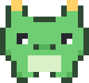

#  session-pet

A pixel-art desktop companion for your coding agents: one tiny always-on-top
native pet that watches **every Claude Code and Codex session** on your Mac —
it bounces while agents work, dings the moment one needs your input (including
permission prompts, via an optional hook), flags sessions that stall mid-turn,
shows live per-session cards (project, current tool, context size, last
message), and levels up across 8 species as you ship. Plain Swift/AppKit,
no Xcode, no dependencies.

**Docs & tour:** <https://chud-lori.github.io/session-pet/>

## Quick install

```bash
git clone https://github.com/chud-lori/session-pet.git
cd session-pet
./install.sh --login-item   # build + run + start at every login
```

`./install.sh --uninstall` removes it.

## Using the pet

| Action | How |
|---|---|
| Open the session panel | **click** the pet |
| Close the panel | click the pet again, or click anywhere outside |
| Move the pet | **drag** it |
| Menu (panel / sound / quit) | **right-click** the pet |
| Acknowledge a finished/needs-input session | click its card in the panel |
| Expand a session card (path, tokens, last message) | click the card |
| Change species / toggle sound | panel → **settings ▸** |

The `pet` helper works from anywhere in the repo:

```bash
./pet          # start — or bring it back after quitting
./pet stop     # quit (same as right-click → Quit)
./pet status   # is it running?
```

It also returns automatically at next login (LaunchAgent). **Sounds:** a quiet
*Glass* when a turn finishes; a louder **double *Ping*** when an agent needs
your input — repeating every 45s (max 3×) until you acknowledge it, so you
won't miss it while watching a video. **Dots under the pet** (2+ sessions):
green = working, yellow = finished, blinking red = needs you.

> Maintainers: the docs page is served from `docs/` — enable it once via
> GitHub **Settings → Pages → Deploy from a branch → `main` / `/docs`**.

## Native desktop pet (primary)

```bash
swiftc -O native/src/*.swift -o native/SessionPet   # build (CLT only, no Xcode)
./native/SessionPet [scale]                         # run, default scale 5
```

Plain Swift/AppKit split across a few files in `native/src/` — no Xcode
project, no dependencies. Same behavior as the Python pet plus what only native
can do: true per-pixel transparency with the **whole window clickable**,
retina-crisp sprites, popover-style panel (click anywhere outside dismisses),
per-session **context size** (`ctx 84k`) and the agent's **last message
snippet** in the panel. Sprites and species come from `native/assets.json` —
the sprite **source of truth** (originally exported from the legacy
`pet_window.py` pixel maps via `python3 native/export_assets.py`). Shares
`.state/state.json` with the Python pet.

## Non-goals

Kept deliberately out of scope — say no early, stay small:

- **No 17-provider support** — Claude Code + Codex only.
- **No in-pet approve/deny** of permission prompts; the pet notifies, you act
  in the terminal.
- **No chat-with-agent** from the pet window.
- **No menu-bar / notch rewrite** — it stays a floating desktop pet.
- **No more gamification** — XP, stages, and species are the ceiling.

**False-positive budget:** any false *needs-input* or *ready* ding is
release-blocking; a false *working* is tolerable but must be time-bounded.

## Python desktop pet (deprecated / legacy)

> `pet_window.py` is **deprecated** — kept for reference only. The native pet
> is the primary implementation, and `native/assets.json` is the sprite source
> of truth.

```bash
python3 pet_window.py            # or --scale 8 for a bigger pet
```

A frameless, truly transparent, always-on-top pixel-art pet that watches every
agent session on the machine — Claude Code (`~/.claude/projects/*.jsonl`) and
Codex (`~/.codex/sessions/**/rollout-*.jsonl`) — via a per-provider parser that
normalizes both to the same phases (the multi-provider idea comes from
[code-island](https://github.com/rifqiakrm/code-island)):

- **working** — bounces fast with sparkles ✦ while any session is mid-turn.
  Turn-end is detected from the transcript's last event (`stop_reason:
  end_turn` for Claude, `task_complete` for Codex) — a long tool run or
  thinking pause does NOT count as "done" (no false dings).
- **needs you** — when an agent literally asks you something
  (`AskUserQuestion`/`ExitPlanMode` for Claude, `request_user_input` for
  Codex): red blinking dot + Ping.aiff. When a turn just ends: **!** +
  Glass.aiff.
- **sleeping** — drifting z's when no session has activity

With 2+ sessions, status dots appear under the sprite (green working · red
needs input · yellow done), and the modal lists each session with what it is
doing right now (tool + command/file, per provider).

Because the window is transparent, clicks only land on the pet's opaque pixels
(macOS passes clicks through transparent areas) — click the body or its ground
shadow.

Multiple sessions: one pet watches them all — it works while *any* session is
mid-turn (the modal shows the count), and dings once per session that finishes.

**Click the pet** → details modal (like the Codex desktop pet's panel): level,
stage, XP progress bar to the next evolution, live Claude status + session
count, last active project, sound toggle, and a **visual sprite picker** (click
a portrait to adopt it). **Drag** to move it anywhere. **Right-click** to quit.

A brand-new pet starts as an egg; picking a sprite in the modal hatches it
instantly (30 XP hatches it automatically too). Sprites are 16px chibi pixel
maps in `pet_window.py` (`PIXELS`) — add your own species by adding a map + an
entry in `pet.py`'s `SPECIES`. Default window scale is 4 (compact); use
`--scale 6` for a bigger pet.

Start it at login (optional): add a LaunchAgent or just put
`nohup python3 ~/Projects/claude-pet/pet_window.py &` in your login items.

- **Mirrors the agent's state** (like Codex pets' 3 states): animates while Claude is
  *working*, perks up when it's *waiting for you*, and *sleeps* when the session idles.
- **Grows across sessions**: earns XP from lines of code (+ session cost), persisting in
  `.state/state.json`. Stages: 🥚 egg → hatchling → adult → 👑 legendary.
- **8 species**: cat, dragon, crab, octopus, dino, fox, alien, turtle.
- Stdlib-only Python, never breaks the statusline (always exits 0, falls back to 🐾).

## Install

Add to `~/.claude/settings.json` (or run `/statusline` in Claude Code and ask it to use
this command):

```json
"statusLine": {
  "type": "command",
  "command": "python3 /Users/nurchudlori/Projects/claude-pet/pet.py"
}
```

## Customize

### Native pet: sprite packs (drop-in)

Drop a JSON file into `sprites/` — one species per file, picked up at the next
pet launch and added to the species picker (no rebuild, no export step):

- **Species key = filename stem**: `sprites/example-slime.json` → species
  `example-slime`. If the key matches a built-in (`cat`, `egg`, …), **your pack
  wins** and replaces that sprite.
- **Schema** — same as one `species` entry in `native/assets.json`:
  `{"name": "Slimey", "emoji": "🫧", "palette": {"X": "#7ee8a2", …},
  "rows": ["....kkkk....", …]}`. Rows are pixel strings; each char is a
  palette key.
- **Conventions**: `.` = transparent; `o`/`w` are eye pixels (the pet redraws
  them as `X` when blinking, so use `X` as the main body color to make closed
  eyes look right). Built-ins are 16px wide.
- Malformed files (bad JSON, missing/empty `rows`) are skipped, never crash;
  run with `SESSION_PET_LOG=1` to see skips in `/tmp/session-pet.log`.
- `sprites/example-slime.json` ships as a working template.

### Native pet: sound packs

The two pet sounds are overridable via optional keys in `.state/state.json`:

- `"soundReady"` — a turn finished (default `Glass.aiff`)
- `"soundInput"` — an agent needs you (default `Ping.aiff`)

Values are either an absolute path or a bare filename resolved against the
repo's `sounds/` dir, e.g. `{"soundReady": "meow.wav"}` plays
`sounds/meow.wav`. Anything `afplay` can play works (aiff/wav/mp3/m4a). A
missing file silently falls back to the system default.

### Python statusline pet (legacy)

```bash
python3 pet.py species              # list species (← marks current)
python3 pet.py set species dragon   # pick your pet
python3 pet.py set name Smaug       # rename it
python3 pet.py status               # XP / stage outside the statusline
```

The name shows as `???` until the egg hatches (30 XP).

## How it works

Claude Code invokes the statusLine command on conversation updates (throttled to
~300 ms), piping session JSON to stdin. The pet derives:

- **state** — from the transcript file's mtime (<15 s = working, <5 min = waiting,
  else sleeping)
- **animation frame** — from the wall clock, so it only animates while Claude is
  actively producing updates (just like a Codex pet's "running" sprite)
- **XP** — per-session max of `lines_added + lines_removed + $cost`, summed across all
  sessions ever (old sessions get pruned into `banked_xp`, nothing is lost)
